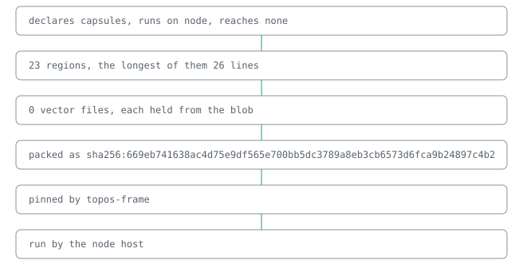

# @lapxo/topos-frame

     

The shape a capsule keeps.

A world for worlds. Point it at a capsule and each of its laws reads the capsule's own lines and the receipts of its code, and says by receipt whether the shape holds. [its regions, read off its own descriptor](docs/reference.md)

## Why pages are lines

A world is trusted by its shape, not by its author. What a stranger can check in a minute is what the frame asks: short regions, one file per line, helpers written once, effects declared, and nothing a place owns spelled in code.

## One capsule, every law

## What it claims

- **It holds {laws} laws, each one region with vectors of its own.** · [receipt](receipts.bound)

## Line

Add to your lock:
sources/topos-frame value=github:Lapxo/topos-frame
uses/topos-frame sha256:<release digest>
Fetch the release asset, verify its sha256 equals the uses/ line, place it in bound/cas/blobs/. Fold: its pages appear.
open: line/install needs=host/resolve — when bound resolves sources/ itself, the fetch line leaves the page by fold.

It rests on topos.

## Check

● 0 cases hold

● `tsc --build`

## Pointers

- [Reference](docs/reference.md)
